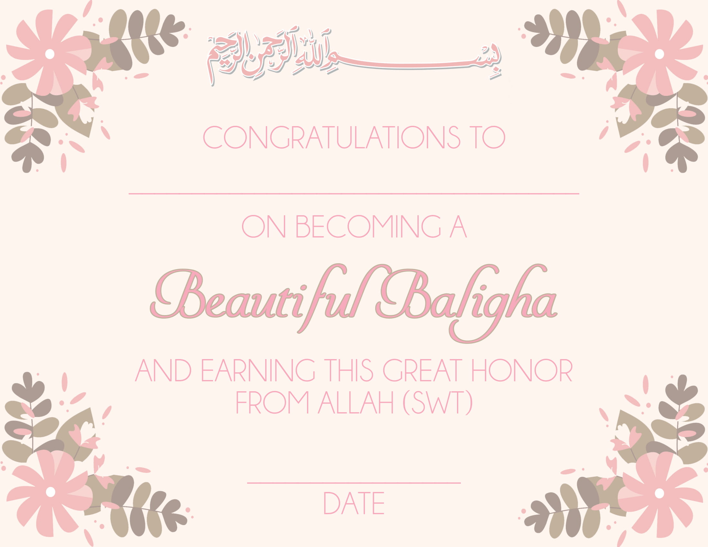
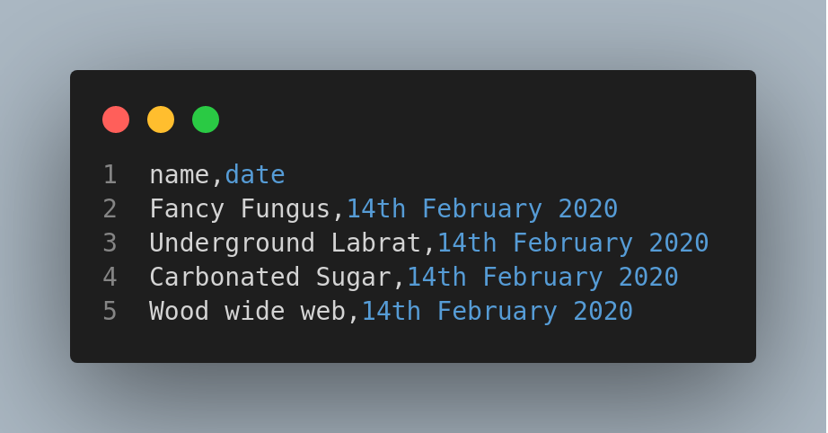
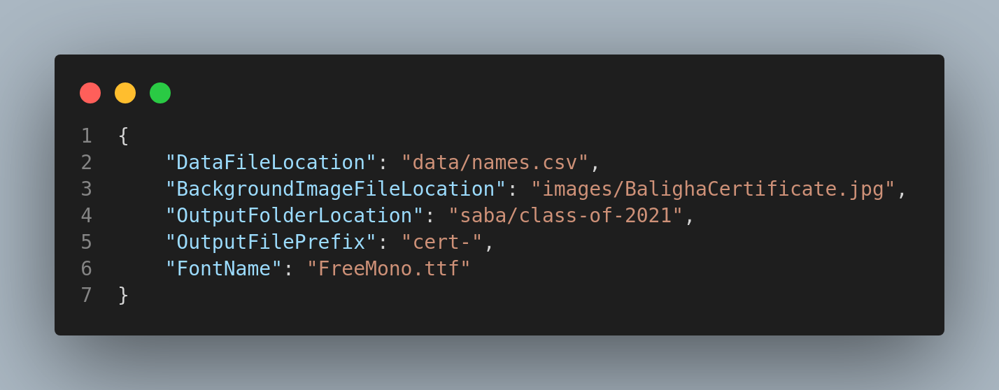
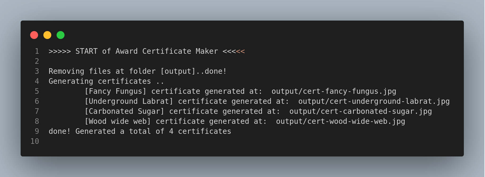
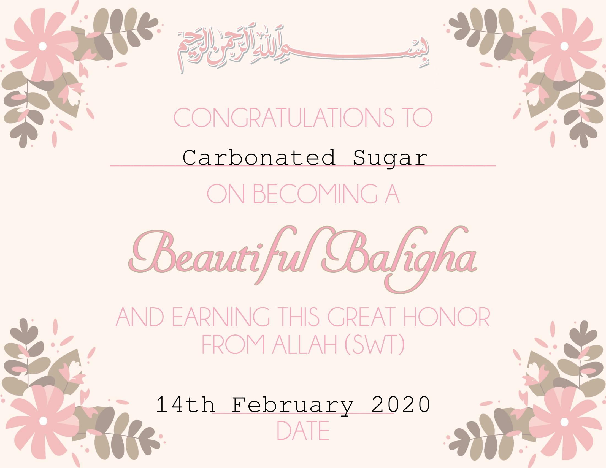

# award-certificate-maker

## About

Use this program to create award certificates for students in bulk.

All you need is

- A background image
- A list of students (name, cert date) in CSV format
- Run the code online or locally (by cloning this repo)
- Setup/Review the configuration file
- Run the code

Continue reading the following sections to learn further details about the above steps.

---

## Detailed Instructions

Follow below **Steps**

1) Upload your award certificate background image to the [images/](images/) folder
2) Add student names inside [data/names.csv](data/names.csv)
3) Review and Update [config.json](config.json) file
4) Run the code

   __CAUTION__: All existing JPG images inside the output folder will be deleted.

5) Review Generated certificate

   Review Output certificate image. You can tweak the x,y positions for the name, date inside the image. Edit [main.py](main.py) and change the following variables on top

      - NAME_X 
      - NAME_Y
      - DATE_X
      - DATE_Y

   and then re-run the code.

---

### Output folder location

Output folder is located at ```./output/{OutputFolderLocation}```, where ```{OutputFolderLocation}``` is the name of folder specified in [config.json](config.json).

### Output filename

Output file is named as  ```{OutputFilePrefix}{name}```, where ```{OutputFilePrefix}``` is the prefix name specified in [config.json](config.json), while ```{name}``` is the name of student specified under name column inside [data/names.csv](data/names.csv).

---

## Background Image



---

## Student list



---

## Config file



---

## Run the program

You can run the code online by visiting [here](https://repl.it/@bilgrami/award-certificate-maker#README.md).

Alternatively, you can clone this repo and run it locally via the following command.

```base
git clone https://github.com/bilgrami/award-certificate-maker.git
pip3 install -r requirements.txt 
python3 main.py
```

## Shell-Output



## Generated Certificate

A separate certificate JPG file gets generated for each student under the output folder.


